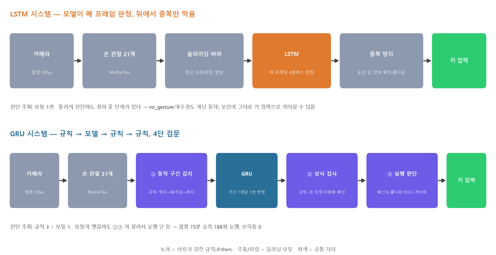
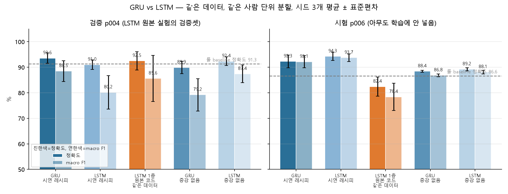
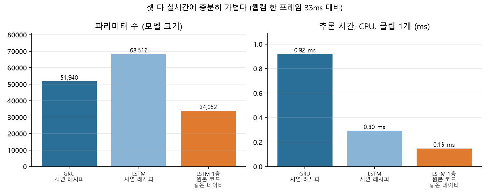
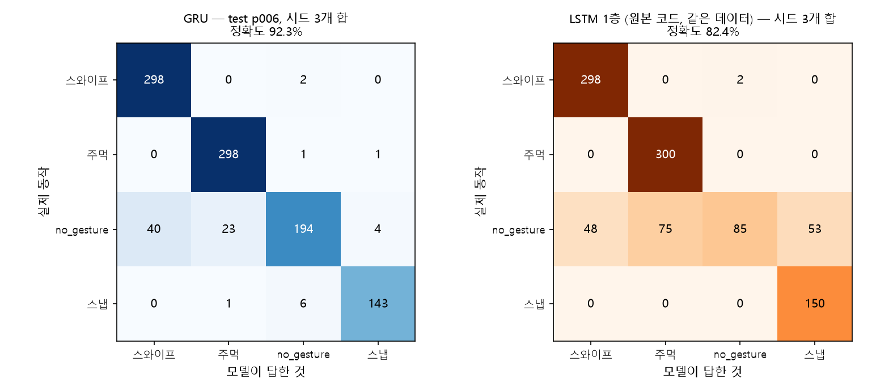

# JETSTURE — 웹캠 손동작으로 PC를 제어하는 비접촉 컨트롤러

> **제트기처럼 빠른 손동작 인식.** 별도 장비 없이, 이미 있는 웹캠 하나로 손동작을 실시간 단축키로 바꿉니다.

<p>
  
  
  
  
  
</p>

경기 AI 멤버십 채용연계형 교육 **4팀 프로젝트**. 웹캠 30fps 영상에서 손 관절 21개를 추적하고, 딥러닝 모델과 규칙을 겹쳐 손동작을 OS 단축키로 변환하는 데스크톱 앱입니다. 화면을 만지지 않고 발표·미디어·주방·의료처럼 손이 닿기 어려운 순간에 PC를 제어하는 것을 목표로 했습니다.

---

## 목차

- [프로젝트 소개](#프로젝트-소개)
- [주요 기능](#주요-기능)
- [동작과 단축키](#동작과-단축키)
- [시스템 구조](#시스템-구조)
- [기술 스택](#기술-스택)
- [데이터셋](#데이터셋)
- [모델과 성능](#모델과-성능)
- [저장소 구조](#저장소-구조)
- [설치와 실행](#설치와-실행)
- [팀과 역할](#팀과-역할)
- [개선 로드맵](#개선-로드맵)
- [라이선스와 이용](#라이선스와-이용)

---

## 프로젝트 소개

손이 닿아야만 동작하는 기존 입력 방식은 발표·요리·의료처럼 화면 접촉이 어려운 순간에 한계가 있습니다. JETSTURE는 **이미 보급된 웹캠만으로** 비접촉 제어를 구현합니다.

```
웹캠 30fps  →  MediaPipe 손 관절 21개 추적  →  동작 분류(GRU + 규칙)  →  OS 단축키 입력
```

정적 포즈(YOLOv8)로 인식을 켜고 끄는 **게이트**를 두고, 그 안에서 동적 제스처(GRU 시계열 모델)를 분류해 사용자가 지정한 단축키를 실행합니다. OS 단축키를 직접 입력하므로 **어떤 프로그램이든** 제어할 수 있습니다.

## 주요 기능

- **동적 제스처 4종 + 정적 포즈 3종** — 손동작으로 명령, 포즈로 인식 게이트 On/Off
- **자유 키 매핑** — 손동작을 원하는 단축키로 직접 녹화. 프리셋 5종 제공
- **연습 모드 / 실제 모드** — 실제 키를 누르지 않고 익힌 뒤 실제 입력으로 전환
- **실시간 진단 대시보드** — 관절과 판정 확률을 30fps로 표시하는 customtkinter UI
- **경량 구조** — 학습은 GPU, 실사용은 일반 CPU로 충분(GRU 추론 1ms 미만)

## 동작과 단축키

기본값(`gestures.json`) 기준입니다. 아래 단축키는 앱의 "키 매핑" 페이지에서 바꾸면 `gestures.json`에 바로 저장됩니다.

| 종류 | 손동작 / 포즈 | 기본 동작 | 기본 단축키 |
| --- | --- | --- | --- |
| 동적 | 스와이프 | 지정 키 입력 | `Space` |
| 동적 | 주먹 쥐기 | 창 목록 열기 | `Ctrl+Alt+Tab` |
| 동적 | 핑거 스냅 | 창 선택 | `Enter` |
| 동적 | 동작 없음 | (무시) | — |
| 정적 | 손바닥 유지 | 인식 시작 | 게이트 On |
| 정적 | 주먹 유지 | 인식 종료 | 게이트 Off |
| 정적 | 취소 포즈 유지 | 바탕화면 보기 | `Win+D` |

> 정적 포즈는 **2초 유지**해야 발동합니다(`gate.hold_seconds`).

## 시스템 구조

**포즈로 켜고, 손동작으로 실행한다.** 딥러닝 모델 두 개를 사람이 정한 규칙으로 묶은 **4단 검문** 구조입니다.



```
YOLOv8 정적 포즈 게이트 (세 포즈를 2초 유지하면 인식 전환)
        ↓
MediaPipe 손 관절 21개
        ↓
 ① 구간 감지     정지 → 움직임 → 정지 (규칙)
 ② GRU 판정      구간당 1회, 4클래스 분류 (딥러닝)
 ③ 동작 검증     손 모양과 이동량 상식 검사 (규칙)
 ④ 실행 판단     확신도와 쿨다운 (규칙)
        ↓
      키 입력
```

규칙 세 겹(구간 감지 · 동작 검증 · 실행 판단)이 딥러닝 판정 한 겹을 감싸, **실시간 15분 시연에서 오작동 0**을 기록했습니다.

## 기술 스택

| 영역 | 사용 기술 |
| --- | --- |
| 손 관절 추적 | **MediaPipe** (Hand Landmarker, 21개 관절) |
| 동적 제스처 | **PyTorch** GRU (CUDA 12.6 학습, CPU 추론) |
| 정적 포즈 게이트 | **Ultralytics YOLOv8n** |
| 영상 처리 | **OpenCV** |
| 시연 UI | **customtkinter** |
| 평가·비교 실험 | **scikit-learn**, **pandas**, **matplotlib** |

성능 요약: **30fps** 실시간 처리 · GRU **1ms 미만** CPU 추론 · YOLO **6ms** GPU 추론. 학습만 GPU를 쓰고 실사용은 일반 CPU로 가능한 경량 구조입니다.

## 데이터셋

공개 데이터셋 대신 **팀원 6명이 동일 규약으로 직접 녹화**해, 학습에 없던 새 사용자까지 검증할 수 있게 했습니다. ([공개 데이터셋을 쓰지 않은 이유](docs/why_not_jester.md))

| 동적 제스처 (시계열, 약 1,800 클립) | 개수 | 정적 포즈 (이미지, 4,561장) | 개수 |
| --- | ---: | --- | ---: |
| 스와이프 | 554 | 손바닥 `start` | 1,205 |
| 주먹 쥐기 | 497 | 취소 `cancel` | 1,132 |
| 핑거 스냅 | 450 | 주먹 `stop` | 1,021 |
| 동작 없음 | 307 | 빈 배경 | 1,203 |

> 전체 원본 수집 데이터(`*.npz`·이미지)는 용량 때문에 저장소에 포함하지 않았습니다(동적 예제 `data/dynamic/`의 user00 37개만 Git 제공). **시연용 학습 가중치는 저장소에 포함되어** 클론 후 바로 실행됩니다. 수집 규약과 절차는 [`programs/`](programs) 및 [수집 안내](docs/team_conventions.md)를 참고하세요.

## 모델과 성능

### 동적 제스처 — 같은 성능에 24% 더 가벼운 GRU

새 사용자 기준 시드 3회 반복 평가에서 GRU와 LSTM은 **오차 범위가 겹쳐 셀 종류로는 우열이 없었습니다.** 성능이 같다면 파라미터가 24% 적은 GRU가 합리적 선택이라 판단했습니다.

| 지표 | GRU | LSTM |
| --- | ---: | ---: |
| 정확도 (새 사용자, 시드 3회) | 92.3 ± 2.5 | 94.3 ± 1.6 |
| 파라미터 (2계층·64노드 동일) | **51,940** | 68,516 |
| CPU 추론 | 1ms 미만 | 1ms 미만 |

<p>
  
  
</p>

전체 비교는 [GRU vs LSTM 리포트](reports/gru_vs_lstm_0907/summary.md)에 있습니다.

### 동적 제스처 인식률

| 지표 | 값 |
| --- | ---: |
| 학습에 포함된 사용자 | 100 |
| 새로운 사용자 평균 | 89 |
| 실시간 15분 시연 오작동 | **0** |

제스처별(새 사용자 5명 평균): 스와이프 **100** · 주먹 **96** · 핑거 스냅 **83** · 동작 없음 62. 약점은 사람마다 다른 평상시 손 움직임이며, 해당 사용자가 학습에 포함되면 해소됩니다.



### 정적 포즈 (YOLOv8n)

가장 가벼운 YOLOv8n으로 세 포즈를 완벽 분리했습니다.

| 지표 | 값 |
| --- | ---: |
| mAP@50 | 0.995 |
| mAP@50-95 | 0.944 |
| Precision | 0.999 |
| Recall | 1.00 |

`cancel` · `start` · `stop` 세 포즈 오분류 0. 회전 증강으로 다양한 각도에 대응했습니다.

### 실시간 통합

두 모델을 규칙으로 묶어 실시간에서 **오작동 0**을 달성했습니다. 15분 시연 기준 정상 실행 **188회**(스와이프 69 · 주먹 50 · 핑거 스냅 69), 스와이프 실행률 **69/70**, 의도와 다른 실행 **0회**.

## 저장소 구조

두 팀(시계열·YOLO)의 세 브랜치 구현을 **하나의 통합 프로그램**으로 합쳤습니다. `python main.py`가 단일 진입점이며, 모든 기능은 `python main.py <command>`로 실행합니다(목록: `python main.py --help`).

```
jetsture/
├─ main.py                 # 단일 진입점 — check · 통합 UI · 수집/학습/평가/YOLO 디스패치
├─ gestures.json           # 키 매핑 · 게이트 설정
├─ EDA.ipynb               # 데이터 탐색(EDA) 노트북
├─ gesture/                # 동적 GRU 파이프라인 + 정적 게이트 검출기(static_detector.py)
│                          #   구간 감지·전처리·모델·상식 검사·파이프라인·gate
├─ scripts/                # gesture_app.py(시연 UI) · train_model · eval · compare · replay · slice · valid_npz
├─ programs/               # 제스처 데이터 수집기 (웹캠·영상 수집·추출·검증)
├─ yolo/                   # 정적 포즈 YOLO 학습·설정(yolo.py·*.yaml) + 학습 run 산출물(artifacts/)
├─ models/                 # 시연용 가중치(커밋됨): gru_gesture.pt/.json · static/v3.pt · hand_landmarker.task
├─ data/
│  ├─ dynamic/             # 동적 제스처 NPZ (라벨별)
│  └─ static/              # 정적 YOLO 이미지·라벨 (start_stop_cancel, v3)
├─ reports/                # GRU vs LSTM · LOO 교차검증 실험 결과 (→ reports/README.md)
├─ docs/                   # 사용 설명·성능·실험 기록·발표 자료 (→ docs/README.md, history/)
├─ integration/            # 팀 통합 기록 (REPORT · FINAL · source-manifest)
├─ tests/                  # 통합 테스트
├─ pyproject.toml / uv.lock
└─ README.md
```

## 설치와 실행

### 준비물

Windows 10/11 · Python 3.12 · [uv](https://docs.astral.sh/uv/) · 웹캠. NVIDIA GPU가 있으면 YOLO가 빨라지고, 없어도 CPU로 동작합니다.

### 설치

```powershell
git clone https://github.com/Spice7/jesture_project.git
cd jesture_project
py -3.12 -m pip install uv      # uv가 이미 있으면 생략
uv sync --locked
```

Windows에서는 `torch`/`torchvision`을 PyTorch CUDA 12.6 저장소에서 내려받습니다(약 2.5GB). GPU가 없어도 CUDA 휠은 CPU로 정상 동작합니다.

### 실행

시연용 가중치가 저장소에 포함되어 있어 **`uv sync` 후 바로 실행**됩니다. 기본은 연습 모드(실제 키를 누르지 않음)입니다.

```powershell
uv run python main.py check    # 추론 자산 확인 (카메라·키 입력 없음)
uv run python main.py          # 통합 UI, 연습 모드
uv run python main.py --live   # 처음부터 실제 키 입력
```

실행 순서: ① 사이드바 아래 "실제 키 입력" 스위치 → ② 손바닥을 카메라에 2초(게이트 On) → ③ 제스처.

> 포함된 가중치(`models/gru_gesture.pt`·`.json`, `models/static/v3.pt`, `models/hand_landmarker.task`)는 `main.py check`로 존재를 확인할 수 있습니다. 자세한 사용법은 [사용 설명서](docs/user_guide.md)와 [UI 구조 문서](docs/gesture_app.md)를 참고하세요. 카메라는 한 프로그램만 쓸 수 있습니다.

## 팀과 역할

경기 AI 멤버십 4팀. **역할 분담이 있어도 팀원 모두가 수집→학습 전 과정을 한 번씩 경험**하는 것을 실습 목표로 삼았습니다.

| 팀 | 팀원 | 주요 역할 |
| --- | --- | --- |
| YOLO팀 | 이건호(팀장) · 김민정 · 변은아 | 이미지 수집 → 라벨링·증강 → YOLOv8 학습 → 포즈 게이트 |
| 시계열팀 | 김우진 · 최정민 · 최태순 | MediaPipe 시퀀스 수집 → GRU·LSTM 비교 → 실시간 파이프라인·UI |

## 개선 로드맵

**현재 한계**

- 사람별 평상시 손 움직임 편차로 새 사용자에서 인식률 변동
- 손바닥 하나 이하의 짧은 거리 스와이프는 미검출
- 짧은 개발 기간으로 6명 데이터에 한정된 데이터셋

**발전 방향** — 모델 교체가 아니라 데이터와 규칙의 확장으로 성장

- 참가자와 동작 스타일 다양화, 다양한 "동작 없음" 사례 추가 수집
- few-shot 개인화 보정 — 몇 번의 시연으로 사용자 맞춤
- 게이트와 명령의 시간 충돌 완화

OS 단축키를 제어하므로 스마트홈·게임·키오스크 등으로 확장할 수 있습니다.

## 라이선스와 이용

경기 AI 멤버십 채용연계형 교육 과정에서 진행한 **팀 실습 프로젝트**입니다. 팀원 6명의 공동 작업물을 포함하므로, 코드·데이터·모델의 재사용이나 배포가 필요하면 사전에 문의해 주세요.
